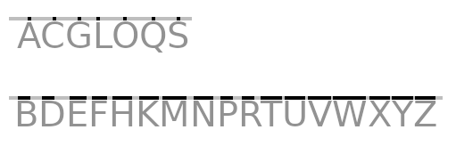

# Mastering Morse Code

After reading this page - and twenty minutes of memorization - you will be able to (almost) instantly encode and decode Morse code.

When discussing Morse code it is common to use 'dit' to represent '.' and 'dah' to represent '-'.

## Encoding

Encoding text into Morse Code can be done with the following alphabet:

**A**CE, **B**RASS, **C**RAWL, **D**ULL, **E**G, **F**OCUS, **G**ETS, **H**ALLS, **I**LL, **J**ADED, **K**ELP, **L**OYAL, **M**EN, **N**BC, **O**VER, **P**ANEL, **Q**UEST, **R**ATS, **S**OLO, **T**V, **U**GLY, **V**ALOR, **W**ONT, E**X**POSE, **Y**UCKY, **Z**EROS

The task of remembering the alphabet can be made slightly easier if it is re-arranged into meaningful (but silly) sentences.

    SOLO ACE ZEROS PANEL
    LOYAL BRASS EXPOSE ILL VALOR
    UGLY HALLS WON'T FOCUS JADED MEN
    NBC TV GETS DULL QUEST (E.G. RATS CRAWL OVER YUCKY KELP)

* In the sentences above, each word is used exactly once, however, words may be re-used, if desired. (e.g. 'MEN EXPOSE RATS'. 'RATS CRAWL OVER HALLS').

* The words can be rearranged in any order (e.g. 'MEN EXPOSE UGLY PANEL').

* Connecting-words can be used (e.g. 'MEN FOCUS on QUEST') provided you always remember what the connecting-words are, and that they should be ignored.

* Different words can be used. (See '[Alternate words for encoding](#alternate-words-for-encoding)', below.)

The letters `ACGLOQS` represent 'dits'; the letters `BDEFHKMNPRTUVWXYZ` represent 'dahs'. This is very easy to remember if you imagine a horizontal line is drawn across the top of the letters. All the 'dit-letters' will touch the line at a single point. All the 'dah-letters' will span the line, or touch the line at multiple points. The letters 'I' and 'J' are not used because they could be either a 'dit' or a 'dah' depending on the font that is used.

To encode text as Morse code:
   1. Spell the text using the alphabet above. All letters must be capitalized.
   1. Remove the first letter of each word. (For 'X', remove the 'EX' prefix.)
   1. The remaining letters represent the Morse code.
   1. Read across the tops of the letters to generate Morse code.

For example: The word, 'EXPERT' would be encoded as follows:

|Letter | Word   | Remove Prefix  | Morse Code |
|-------|--------|----------------|------------|
| E     | EG     | G              | .          |
| X     | EXPOSE | POSE           | -..-       |
| P     | PANEL  | ANEL           | .--.       |
| E     | EG     | G              | .          |
| R     | RATS   | ATS            | .-.        |
| T     | TV     | V              | -          |

## Decoding

Decoding Morse Code into text can be done with the following phrases:

A Year; Eighty One; Debby; Detects; Ease Into It; ETA; Jeez; Gee, Tea Is Cute; Ice; I Tease You; Casey; Katie is Wise; Emmy Goes To; Empty; Any Dick; Auntie Kay; Ariel; Essay H; Steve; Teen; Titty Meat; You, We Fuck; Weepy; Witty Jay(bird)

When decoding an encoded word, each time a 'dit' or a 'dah' is added, the letter is changed.

Suppose we start with a single 'dit'. This represents the letter 'E'.

  * If the 'dit' (E) is followed by a 'dah' (T), we get 'dit-dah', which is an 'A'.
  * If the 'dit' (E) is followed by another 'dit' (E), we get 'dit-dit', which is an 'I'.

Another way of writing that is:

  * `E + T = A`. Or `ET=A`
  * `E + E = I`. Or `EE=I`

The pattern can continue. Suppose we start with 'dit-dah'. This represents the letter 'A'.

  * If the 'dit-dah' (A) is followed by a 'dah' (T), we get 'dit-dah-dah', which is a 'W'.
  * If the 'dit-dah' (A) is followed by a 'dit' (E), we get 'dit-dah-dit', which is an 'R'.

Another way of writing that is:

  * `A + T = W`. Or `AT=W`
  * `A + E = R`. Or `AE=R`

The following table lists all letter transitions. (The letters 'E' and 'T' are excluded.)

| Pair | Result |
|------|--------|
| AE   | R      |
| AT   | W      |
| DE   | B      |
| DT   | X      |
| EE   | I      |
| ET   | A      |
| GE   | Z      |
| GT   | Q      |
| IE   | S      |
| IT   | U      |
| KE   | C      |
| KT   | Y      |
| ME   | G      |
| MT   | O      |
| NE   | D      |
| NT   | K      |
| RE   | L      |
| SE   | H      |
| ST   | V      |
| TE   | N      |
| TT   | M      |
| UE   | F      |
| WE   | P      |
| WT   | J      |

These transitions can be more easily memorized by connecting them to phrases.

In the table below, you will have to use your imagination to get the Transliterations correct. Also, the letter 'W' is pronounced as 'Whu', not 'Double-you'.

| Pair | Result |  Transliteration                                   | Phrase           |
|------|--------|----------------------------------------------------|------------------|
| AE   | R      | Aay Eee Er / Ayea**R**                             | A Year           |
| AT   | W      | Aay-Tee-W / Eighty **W**on                         | Eighty One       |
| DE   | B      | Deh-**B**ee                                        | Debby            |
| DT   | X      | Dee-Tee-Ex / Dee-Tuh-Ex                            | Detects          |
| EE   | I      | Eee-Eee Into It / Eeeee's **I**nto It              | Ease Into (It)   |
| ET   | A      | (Estimated Time of Arrival)                        | ETA              |
| GE   | Z      | Gee-Eee-Zuh / Geeee**Z**                           | Jeez             |
| GT   | Q      | Gee Tee Queue / Gee Tee is **Q**ueute              | Gee, Tea Is Cute |
| IE   | S      | Eye Eee Ce / Eye-yeece / Eye-yee**S**              | Ice              |
| IT   | U      | Eye Tee **U**                                      | I Tease You      |
| KE   | C      | Kay-Eee-Cee / Kay-eee-See                          | Casey            |
| KT   | Y      | Kay-Tee Wye / Kay-Tee is Wyse / Kay-Tee Is **Y**'s | Katie is Wise    |
| ME   | G      | Em-Eee G / Emmy **G**oes (to)                      | Emmy Goes (To)   |
| MT   | O      | Em-Tee / Empty (O is like zero, which is empty)    | Empty            |
| NE   | D      | Enn-Eee Dee / Ann-Eee Dee / Any **D**              | Any Dick         |
| NT   | K      | Enn-Tee Kay / Onn-Tee Kay / Auntie **K**ay         | Auntie Kay       |
| RE   | L      | Are-Eee-El / Ar-ee-el                              | Ariel            |
| SE   | H      | Ess-Eee Aich / Ess-ayy-aich / Essay **H**          | Essay H          |
| ST   | V      | STee**v**                                          | Steve            |
| TE   | N      | Tee-Eee **N**                                      | Teen             |
| TT   | M      | Tee-Tee **M**eat                                   | Titty Meat       |
| UE   | F      | You-Eee F / You-wee **F**                          | You, We Fuck     |
| WE   | P      | Wh-Eee-Pee / Wee**P**ee                            | Weepy            |
| WT   | J      | Wh-Tee Jay / Whi-tee **J**ay                       | Witty Jay(bird)  |

Decode `.--.` using the phrases in the table above.

  1. Look at the first symbol. The first symbol is a '.', which is an 'E'. We now have the letter 'E'.

  1. Look at the second symbol. The second symbol is a '-', which is a 'T'. We now have 'ET'. Applying the phrase 'ETA' (ET**A**) transforms the 'ET' into the letter 'A'.

  1. Look at the third symbol. The third symbol is another '-', which is a 'T'. We now have 'AT'. Applying the phrase 'Eighty-one' (Aye-Tee-**W**on) transforms the 'AT' into the letter 'W'.

  1. Look at the fourth symbol. The fourth symbol is a '.', which in an 'E'. We now have 'WE'. Applying the phrase 'Weepy' (Wh-Eee **P**ee) transforms the 'WE' into the letter 'P'.

So, `.--.` is the letter 'P'.

Decode `-.-` using phrases in the table above.

  1. Look at the first symbol. The first symbol is a '-', which is a 'T'. We now have 'T'.

  1. Look at the second symbol. The second symbol is a '.', which is an 'E'. We now have 'TE'. Applying the phrase 'Teen' (Tee-Eee **N**) transforms the 'TE' into the letter 'N'.

  1. Look at the third symbol. The third symbol is a '-', which is a 'T'. We now have 'NT'. Applying the phrase 'Auntie Kay' (En-Tee-**K**ay) transforms the 'NT' into the letter 'K'.

So, `-.-` is the letter 'K'.

As you become more familiar with Morse code, you will be able to skip steps. For example, once you know that '--' is 'M', when decoding something like '--.-', you can immediately replace the first two symbols ('--') with 'M' and then proceed with step-by-step decoding. Eventually you will be able to recognize entire sequences without having to perform any step-by-step decoding.

# Notes

Obviously, for both encoding and decoding, you are free to make up your own associations to make memorization easier. The two tables below may be of use.

### Alternate words for encoding

|LETTER| CODE | WORDS |
|------|------|-------|
|  A   | .-   | ACE,ACT,AGE,ALB,ALE,ASH,ASK,ASP |
|  B   | -... | BELLA,BELLS,BRAGG,BRAGS,BRASS,BULLS |
|  C   | -.-. | CELTS,CHANG,CHAPS,CHARS,CHATS,CHOPS,CHOWS,CRABS,CRAMS,CRAPS,CRAWL,CRAWS,CROPS,CROWS,CULTS,CUSPS,CYSTS,CZARS |
|  D   | -..  | DEAL,DELL,DRAG,DUAL,DULL,DUOS |
|  E   | .    | EG,EL,ES |
|  F   | ..-. | FACES,FACTS,FASTS,FLAPS,FLATS,FLAWS,FLAYS,FLOES,FLOPS,FLORA,FLOWS,FOAMS,FOCUS,FOLDS,FOLKS,FOODS,FOOTS |
|  G   | --.  | GEES,GEMS,GENA,GETS,GNUS,GREG,GRUS,GUMS,GUNS,GUTS,GUYS,GYMS,GYPS,GYRO |
|  H   | .... | HALLS,HALOS |
|  I   | ..   | ILA,ILL,IOS,ISO |
|  J   | .--- | JADED,JANET,JAPED,JARED,JAUNT,JAWED,JAYNE,JAZZY,JOKED,JOKER,JOYED |
|  K   | -.-  | KECK,KELP,KHAN,KNOB,KNOT,KNOW,KNOX,KWAN,KYLE |
|  L   | .-.. | LAMAS,LARGO,LAVAL,LAYLA,LONGS,LOYAL |
|  M   | --   | MEH,MEN,MET,MEW,MHZ,MUD,MUM |
|  N   | -.   | NBA,NBC,NEG,NEO,NES,NFL,NRA |
|  O   | ---  | OBEY,ODER,OKED,OMEN,ONYX,OPEN,OVEN,OVER,OVUM,OWED,OWEN,OXEN |
|  P   | .--. | PANDA,PANEL,PANES,PANTS,PANZA,PARES,PARKA,PARKS,PARTS,PATEL,PATES,PATHS,PATNA,PAVES,PAWNS,PLUMS,PLUTO,POEMS,POETS,POKES,PONDS,PONES,POPES,POPPA,PORES,PORNO,PORTS,POTTS,POURS,POUTS,POXES |
|  Q   | --.- | QUEST,QURAN |
|  R   | .-.  | RAMA,RAMS,RANG,RAPS,RATS,RAUL,RAYS,ROBS,RODS,ROEG,ROES,ROTS,ROWS |
|  S   | ...  | SACS,SAGA,SAGO,SAGS,SASS,SLAG,SLOG,SOLO,SOLS,SOSA |
|  T   | -    | TB,TV,TX,TY,TZ |
|  U   | ..-  | UGLY |
|  V   | ...- | VALOR |
|  W   | .--  | WADE,WAFT,WAKE,WAND,WANE,WANT,WARD,WARE,WARM,WARN,WARP,WART,WARY,WATT,WAVE,WAVY,WAXY,WOKE,WOMB,WONT,WORD,WORE,WORK,WORM,WORN,WOVE |
|  X*  | -..- | +BOXWOOD,+EXHALE,+EXPOSE,+FOXHOLE,+OVEREXPOSE,+UNDEREXPOSE |
|  Y   | -.-- | YEARN,YUCKY |
|  Z   | --.. | ZEROS |

`*` The '+' preceding the words for 'X' indicate that the words have extra letters. Remove all letters up to and including 'X' to expose the coded letters.

General tips for making a 'good' alphabet. (The word examples given below may not match any words in the table above.)

 * Minimize words that end with a plural 'S'. (e.g. Was it 'CARD' or 'CARDS'?)
 * Avoid silent letters (e.g. 'KNOW')
 * Avoid homophones (e.g. 'DISC'/'DISK' or 'PORES'/'POURS')
 * Use 'simple-to-spell' words. (e.g. 'XHOSA' could be used, but might be difficult to spell)
 * Avoid double letters that could be mistaken for single letters (e.g. 'BRAGG'/'BRAG')
 * Avoid similar-sounding words (e.g. 'YEOMEN'/'OMEN')
 * Changing a word's function may help when building sentences (e.g. 'FLORA' can be a name or a noun)
 * Try to make sentences grammatically correct. (e.g. When the verb and noun agree, they check each other 'MAN SAYS HI'.)

### Alternate phrases for decoding

| Pair | Result |  Transliteration              | Phrase           |
|------|--------|-------------------------------|------------------|
| EE   | I      | Eee -Eee on the I             | Easy on the eyes |
| NT   | K      | En-Tee Kuh / An-Teek          | Antique          |
| TE   | N      | (None)                        | Ten              |
| DE   | B      | (None)                        | Deb              |
| ME   | G      | (None)                        | Meg              |
| WE   | P      | Wh-Eee Pee                    | We Pee           |
| WT   | J      | Wh-Tee Jay / White-Dee-Jay    | White D.J.       |
